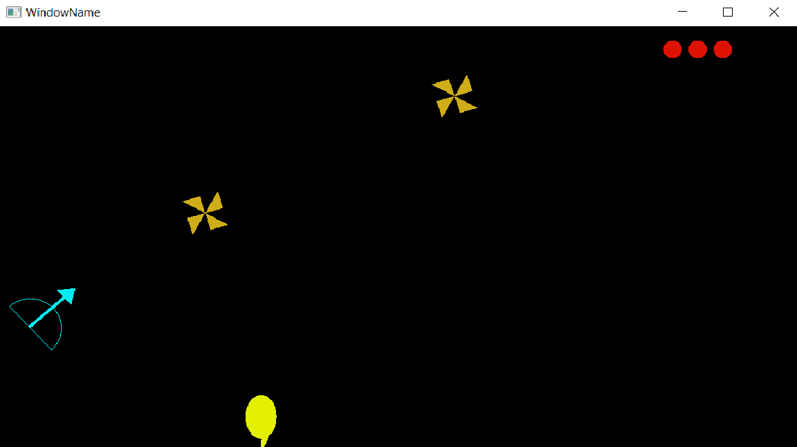
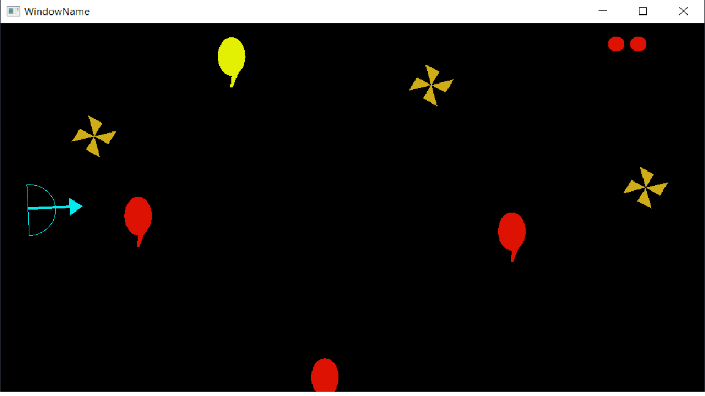
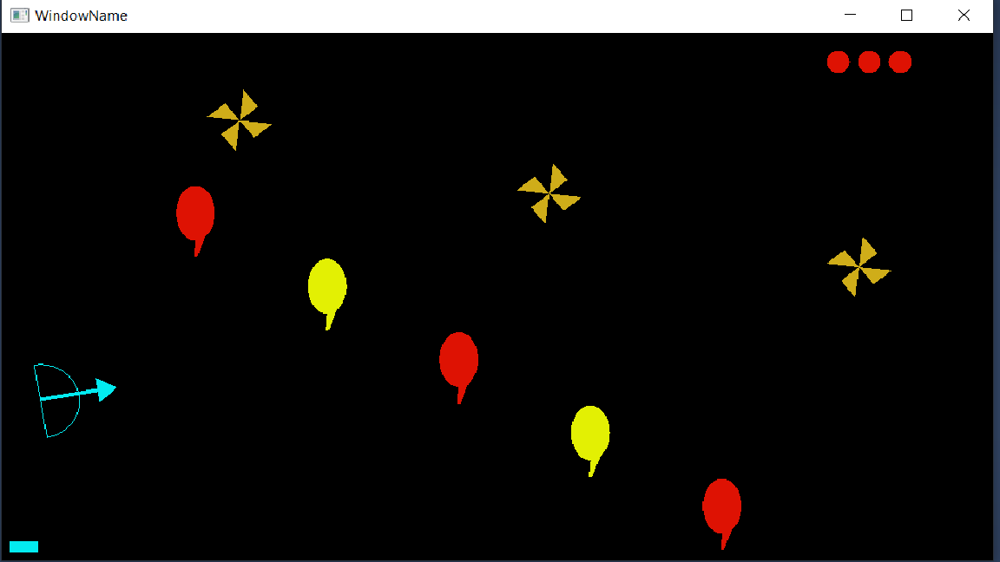
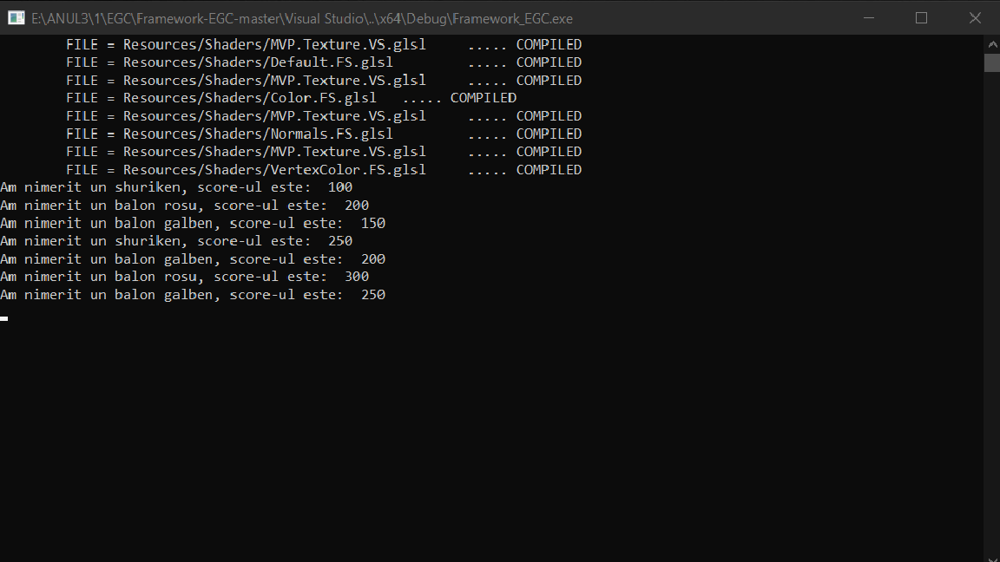

#                                   *Bow and Arrow*

This game is implemented in C++ and the source code can be found in **Source/Laboratoare/Tema1**. 
This can be opened in Visual Studio 2017. You have to open the Visual Studio/Framework_EGC.sln file.

The bow and arrow can be moved up and down using W and D keys and rotate them using the mouse.
When we click on mouse, we set the arrow launch speed. A powerbar is displayed on 
the screen as you can see in one of the images uploaded below.

If the arrow hits a red balloon or a shuriken, we gain 100 points. But if we hit a yellow one, 
we lose 50 points. If a shuriken hits the bow, then we lose a life. If we lose all lifes, the game
will automatically exit.

       
       
      

       
       
       
       
       
       
       
       
       
       
       
       
       
       
       
       
       
       
       
       
      

       
       

